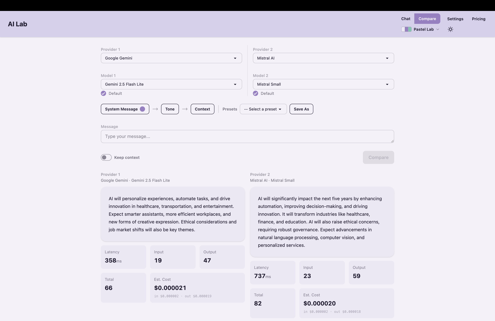

# AI Lab Boilerplate

[](LICENSE)
[](https://www.typescriptlang.org/)
[](https://angular.dev/)
[](https://expressjs.com/)

An open-source boilerplate for testing and comparing AI providers side by side. Bring your own API keys, pick a provider, and see how different models respond — with full token usage, cost estimates, and latency metrics.



---

## Why AI Lab Boilerplate?

I wanted to create something that let's me test system prompts, save them, and test llm's side by side in speed and overal quality of the output. AI Lab Boilerplate gives you **one local interface** to test any supported provider — chat, compare responses side by side, and see exactly what each request costs. All API keys stay on your machine, encrypted at rest.

---

## Features

- **Multi-provider chat** — Switch between Claude, Gemini, OpenAI, and Mistral in one UI
- **Side-by-side comparison** — Send the same prompt to multiple models and compare outputs
- **Real-time streaming** — See tokens as they arrive from any provider
- **Cost tracking** — Per-request token counts and cost estimates based on current pricing
- **Latency metrics** — Response time displayed for every request
- **Local key encryption** — API keys encrypted with AES-256-GCM, never stored in plaintext
- **System prompts & presets** — Configure system message, tone, and context, then save as reusable presets
- **Portable AI Engine** — The `engine/` module can be extracted and used in any Node/TypeScript project
- **Theme switching** — Light and dark mode support
- **Sortable pricing table** — Built-in reference for all model prices

---

## Supported Providers

| Provider | Models |
|---|---|
| **Anthropic Claude** | Opus 4.6, Sonnet 4.6, Sonnet 4.5, Haiku 4.5 |
| **Google Gemini** | 3 Pro, 3 Flash, 2.5 Pro, 2.5 Flash, 2.5 Flash Lite, 2.0 Flash |
| **OpenAI** | GPT-5.2, GPT-5 Mini, GPT-4.1, GPT-4.1 Mini, GPT-4.1 Nano, GPT-4o, o3, o4-mini |
| **Mistral AI** | Mistral Large, Medium, Small, Magistral Medium, Magistral Small |

Want to add a provider? See [docs/adding-providers.md](docs/adding-providers.md).

---

## Quick Start

**Prerequisites:** Node.js 18+ and npm 9+

```bash
git clone https://github.com/leondenengelsen/AI-laboratorium-boilerplate.git
cd AI-laboratorium-boilerplate
npm install
cd engine && npm install && npm run build && cd ..
cd backend && npm install && cd ..
cd frontend && npm install && cd ..
npm run dev
```

The backend generates an encryption key automatically on first launch. Open [http://localhost:4200](http://localhost:4200), go to **Settings**, paste an API key for any provider, and start chatting.

---

## How It Works

AI Lab Boilerplate is three layers working together:

1. **Frontend** (Angular 21 + Tailwind CSS 4 + daisyUI 5) — The UI where you pick providers, send prompts, and view results
2. **Backend** (Express 4) — A thin API layer that manages encrypted keys and routes requests to the engine
3. **AI Engine** (standalone TypeScript) — A portable module that calls provider APIs and returns structured responses with token counts, cost, and latency

When you send a message:
- The backend decrypts your API key **in memory** (never written to disk)
- Passes it to the AI Engine with your prompt
- The engine calls the provider and returns a structured response
- The frontend displays the output with usage metrics

---

## Project Structure

```
AI-laboratorium-boilerplate/
├── engine/          # Portable AI Engine — provider adapters, pricing, types
│   └── src/
│       ├── providers/       # Claude, Gemini, OpenAI, Mistral adapters
│       ├── pricing.json     # Model pricing data
│       └── registry.ts      # Provider registration
├── backend/         # Express API — key management, chat routing, validation
│   └── src/
│       ├── routes/          # API endpoints (chat, keys, providers, presets)
│       └── key-store.ts     # AES-256-GCM encryption/decryption
├── frontend/        # Angular UI — chat, comparison, settings, theming
│   └── src/app/
│       ├── components/      # Chat panel, comparison, settings
│       └── services/        # API communication
├── data/            # Runtime data (gitignored)
└── docs/            # Documentation
```

The AI Engine is fully portable. Copy `engine/` into any Node/TypeScript project, run `npm install`, and import it directly.

---

## API Key Security

API keys are encrypted locally with AES-256-GCM and never stored in plaintext. The encryption key is auto-generated on first launch. See [Getting Started](docs/getting-started.md) for the full security model and how to obtain provider API keys.

**Local use only** — This application is designed to run on your local machine. The backend binds to `127.0.0.1` and has no authentication layer. Do not expose it to the public internet.

---

## Documentation

- [Getting Started](docs/getting-started.md) — Full setup guide, usage walkthrough, and troubleshooting
- [Adding Providers](docs/adding-providers.md) — Step-by-step guide for contributing new AI provider adapters

---

## Contributing

Contributions are welcome. To add a new AI provider, follow the guide in [docs/adding-providers.md](docs/adding-providers.md).

For bug reports and feature requests, open an issue on [GitHub](https://github.com/leondenengelsen/AI-laboratorium-boilerplate/issues).

---

## License

[MIT](LICENSE)
